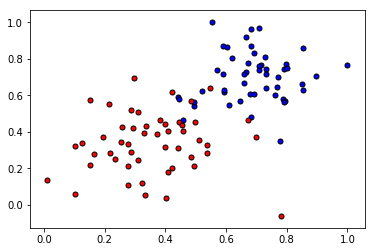
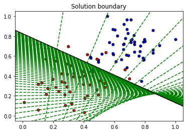
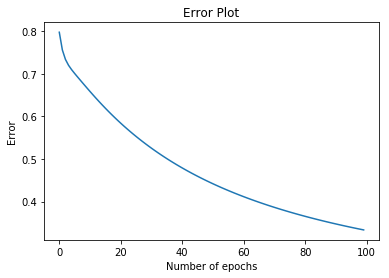

# Gradient-Descent

Implementation and visualization of Gradient descent Algorithm

Implement the following formulas, as explained in the text.

      Sigmoid activation function
      
            𝜎(𝑥)=1/(1+𝑒−𝑥)
 
      Output (prediction) formula
      
             𝑦̂ =𝜎(𝑤1𝑥1+𝑤2𝑥2+𝑏)
 
      Error function
      
            𝐸𝑟𝑟𝑜𝑟(𝑦,𝑦̂ )=−𝑦log(𝑦̂ )−(1−𝑦)log(1−𝑦̂ )
 
      The function that updates the weights
      
          𝑤𝑖⟶𝑤𝑖+𝛼(𝑦−𝑦̂ )𝑥𝑖
          𝑏⟶𝑏+𝛼(𝑦−𝑦̂ )

#Initial plot of data

#After Gradient Descent

#Error rate graph

